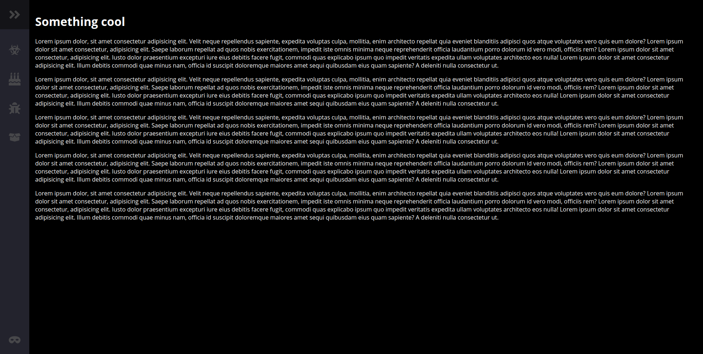
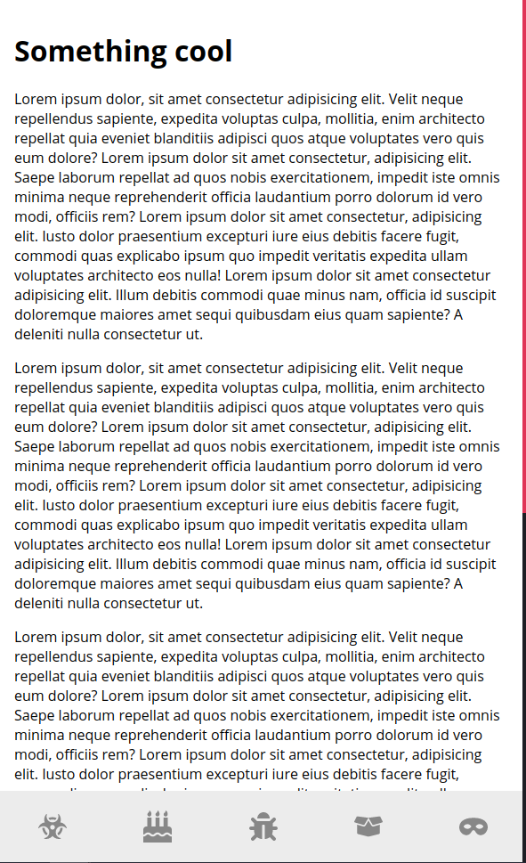
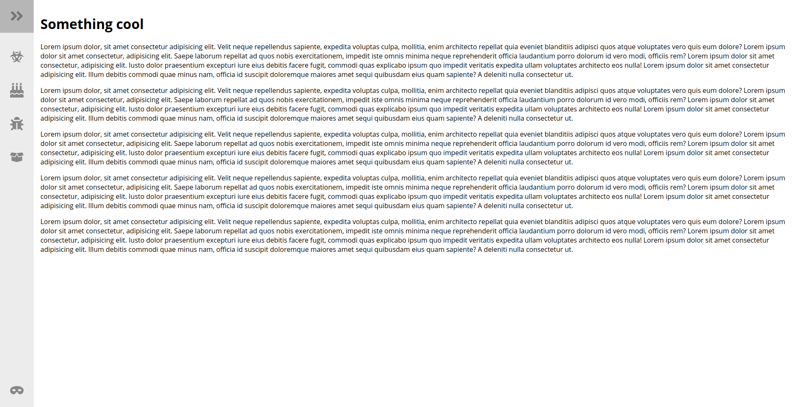

# Some tests and experiments that I have done

## [Responsive Navbar Fireship](responsive-navbar-fireship)

This is a responsive navbar that is on the left side when is on desktop screen and on the bottom when is on mobile screen. The navbar has no function only the "Themify" option change the theme to dark and light. Used just HTML, CSS and JavaScript, based on [Fireship channel on YouTube](https://www.youtube.com/channel/UCsBjURrPoezykLs9EqgamOA/featured).

#### Screens

  
  
  

## [Testing docker](docker-test)

This is a folder where I will explore the Docker. Until now, is a simple Hello World node application.

## [Testing flexbox](flexbox)

this is a folder where I copied the layout of Twitter 2018 using a lot of flexbox in CSS. Is not responsive.

  

